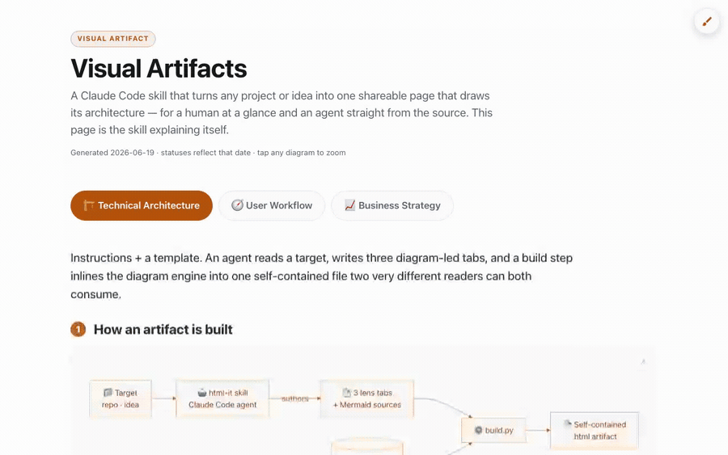
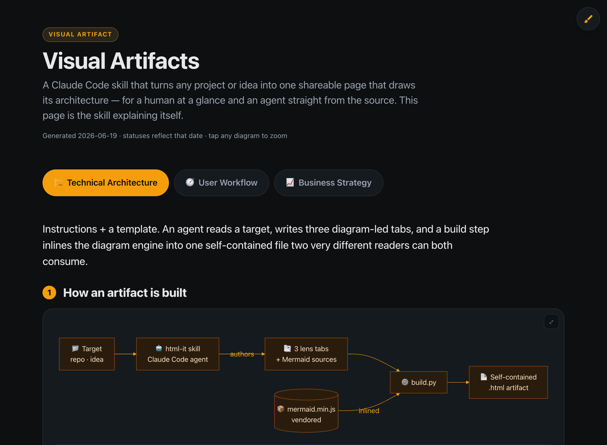
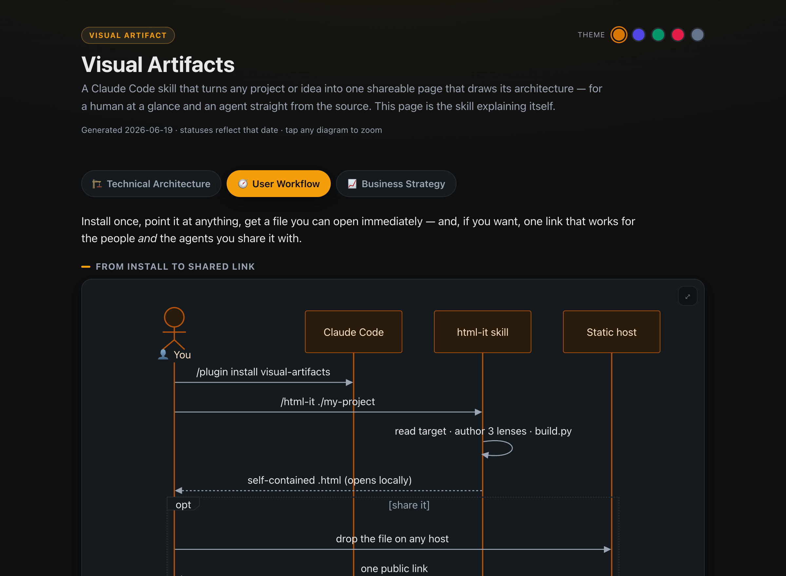
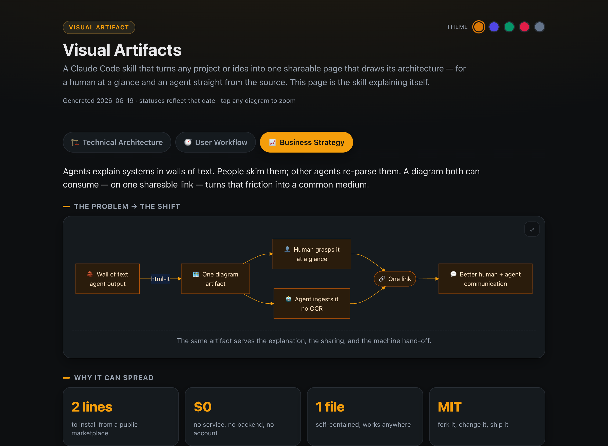

# Visual Artifacts (/html-it)

**Turn any project, codebase, or idea into one shareable page that _draws_ its architecture — instead of burying it in a wall of text.** A [Claude Code](https://claude.com/claude-code) skill.

<p align="center">
  <a href="https://svag2003.github.io/visual-artifacts/">
    
  </a>
  <br>
  <b><a href="https://svag2003.github.io/visual-artifacts/">▶ Open the live example</a></b> &nbsp;·&nbsp; or <a href="media/demo.mp4">watch the full clip</a> &nbsp;·&nbsp; switch tabs, hit the 🖌 to change theme / style / mode, tap a diagram to zoom
</p>

## Install

```
/plugin marketplace add svag2003/visual-artifacts
/plugin install visual-artifacts@visual-artifacts
```

## Use it — `/html-it <anything>`

Once installed, just point the skill at a repo, a folder, or even an idea in plain English:

```
/visual-artifacts:html-it ./my-project
/visual-artifacts:html-it ./services/payments-api
/visual-artifacts:html-it "a webhook that posts Stripe events to Slack"
```

> **You don't have to remember the namespace** — just tell Claude **“html-it ./my-project”** and the skill kicks in.

**What the skill does when you run it:**

🗂 `point it at a target` → ⚡ **`/html-it` reads it** → 📑 `writes 3 diagram-led tabs` → 📄 **one self-contained `.html`** → 🔗 `open it, or host it to share`

No config, no setup. The skill inspects whatever you point it at — the README, the code layout, the configs, or just your description — and draws the **Technical / User / Business** views for you. You get a file you can open immediately, or drop on any host for a link that works for both people and agents.

## Three lenses, one file

Every artifact has three tabs — each **led by a real diagram**, not paragraphs.

| 🏗 Technical Architecture | 🧭 User Workflow | 📈 Business Strategy |
|:---:|:---:|:---:|
|  |  |  |
| How it's built | How a person moves through it | What it is & why it wins |

## One link, two readers

- 👤 **A human** opens it and sees the picture.
- 🤖 **An agent** fetches the *same URL* and reads the architecture straight from the HTML — the diagrams are [Mermaid](https://mermaid.js.org) *text*, so no OCR or screenshot-parsing.
- 📋 **One-click "Copy for agent"** exports the whole artifact as markdown, so you can paste the diagrams + structure straight into another LLM.

That's the whole point: faster communication between people and agents, on one link.

## What you get

One self-contained `.html` file, saved to `visual-artifacts/`:

- **Private & offline by default** — Mermaid is baked in, so it makes **zero** outside calls. Open it, serve it on `localhost`, or email it.
- **Customize live (🖌 top-right)** — a paintbrush popover with **themes** (5 palettes + any color), **3 styles** (Professional / Casual / Silly — they even reshape the diagram nodes), and **Light / Dark / Auto**. Plus **deep-linkable tabs** (`#lens-…`), tap-to-zoom diagrams, and a responsive mobile layout — all instant and persisted.
- **Publish anywhere** — it's static. GitHub Pages, S3 + CloudFront, Netlify, or a plain web server.

<details>
<summary><b>Build modes &amp; customizing →</b></summary>

<br>

| Command | Result |
|---|---|
| `python3 references/build.py artifact.html` | **Self-contained** (~3.3 MB, offline) — the default |
| `python3 references/build.py artifact.html --lightweight` | **Lightweight** (a few KB, loads Mermaid from a CDN) |

Try it without installing:

```bash
claude --plugin-dir ./visual-artifacts
```

It's a normal skill — fork the repo and edit `SKILL.md` (the instructions), `references/template.html` (the look + component kit), or `references/build.py` (the assembler). Re-vendor Mermaid any time with:

```bash
curl -fsSL https://cdn.jsdelivr.net/npm/mermaid@11/dist/mermaid.min.js -o references/mermaid.min.js
```

</details>

## License

MIT — fork it, change it, ship it.
